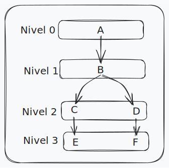

# Uso del Framework Gin

Estos son los endpoints disponibles en este código de ejemplo. Cada caso tiene chequeo de errores, pero son demasiados como para listarlos todos aquí.

## 1-Cargar usuario

Para cargar a Fulanito como usuario se utiliza el método POST: 
```
localhost:8080/curso/usuario
```
Suministrando el nombre en formato JSON
```json
{
    "name":  "Fulanito"
}
```
La respuesta es la siguiente
```json
{
	"name": "Fulanito",
	"userId": 1
}
```

## 2-Obtener usuario
Para obtener el nombre de un usuario anteriormente cargado, se utiliza el método GET, pasando el id del usuario como query parameter.
```
localhost:8080/curso/usuario/1
```
La respuesta es la siguiente
```json
{
	"name": "Fulanito",
	"userId": 1
}
```
## 3-Obtener una lista de todos los usuarios
Para obrener una lista de todos los usuarios se utiliza el método GET.
```
localhost:8080/curso/listaUsuarios
```
La respuesta tiene el siguiente formato
```json
[
	{
		"name":  "Fulanito",
		"userId":  1
	},
	{
		"name":  "Mengano",
		"userId":  2
	},
	{
		"name":  "Jaimito",
		"userId":  3
	}
]
```

## 4-Cargar lista de cursos
Para cargar la lista de cursos se utiliza el siguiente enpoint, con el método PUT.
```
localhost:8080/curso/cargarCursos
```
Los cursos son suministrados en un archivo JSON con el siguiente formato (como par: curso deseado y curso requerido), para simplicidad se utilizaron letras para designar a los cursos, pero puede ser un string cualquiera. El ID del usuario también se suministra en este archivo.
```json
{
	"userId":  1,
	"courses":  [
		{
			"desiredCourse":  "F",
			"requiredCourse":  "D"
		},
		{
			"desiredCourse":  "C",
			"requiredCourse":  "B"
		},
		{
			"desiredCourse":  "B",
			"requiredCourse":  "A"
		},
		{
			"desiredCourse":  "D",
			"requiredCourse":  "B"
		},
		{
			"desiredCourse":  "E",
			"requiredCourse":  "C"
		}
	]
}
```
Donde los cursos siguen la siguiente estructura de correlatividad entre ellos.

Si no hay errores de formato, ni de lógica en la organización de los cursos, los mismos son almacenados de forma ordenada para el usuario indicado, y la respuesta luce como la siguiente.
```json
{
	"userId":  1,
	"courses":  [
		{
			"course":  "A",
			"order":  0
		},
		{
			"course":  "B",
			"order":  1
		},
		{
			"course":  "C",
			"order":  2
		},
		{
			"course":  "D",
			"order":  3
		},
		{
			"course":  "E",
			"order":  4
		},
		{
			"course":  "F",
			"order":  5
		}
	]
}
```
## 5-Listar los cursos cargados para un usuario especifico
Para obtener la lista de cursos cargados para un usuario debe utilizarse el método GET, indicando el id del usuario como un query parameter.
```
localhost:8080/curso/listaCursos/1
```
El resultado para este caso es el siguiente.
```json
{
	"userId":  1,
	"courses":  [
		{
			"course":  "A",
			"order":  0,
			"requiredCourse":  "this course doesn't have requisites",
			"passed":  false,
			"score":  0,
			"available":  true
		},
		{
			"course":  "B",
			"order":  1,
			"requiredCourse":  "A",
			"passed":  false,
			"score":  0,
			"available":  false
		},
		{
			"course":  "C",
			"order":  2,
			"requiredCourse":  "B",
			"passed":  false,
			"score":  0,
			"available":  false
		},
		{
			"course":  "D",
			"order":  3,
			"requiredCourse":  "B",
			"passed":  false,
			"score":  0,
			"available":  false
		},
		{
			"course":  "E",
			"order":  4,
			"requiredCourse":  "C",
			"passed":  false,
			"score":  0,
			"available":  false
		},
		{
			"course":  "F",
			"order":  5,
			"requiredCourse":  "D",
			"passed":  false,
			"score":  0,
			"available":  false
		}
	]
}
```
## 6-Aprobar un curso
Para aprobar un curso, debe utilizarse el método PUT, indicando el id del usuario, el nombre del curso a aprobar, y la nota obtenida por el usuario, todo como query parameters.
```
localhost:8080/curso/aprobarCurso?id=1&name=A&score=8.5
```
El resultado para este caso es el siguiente.
```json
{
	"messege":  "course A passed with score: 8.500000"
}
```

## 7-Eliminar un usuario
Para eliminar un usuario se utiliza el método DELETE, indicando el ID del usuario como query parameter.
```
localhost:8080/curso/borrarUsuario/1
```
El resultado para este caso es el siguiente.
```json
{
	"messege":  "user Fulanito, with id: 1 was successfully deleted"
}
```